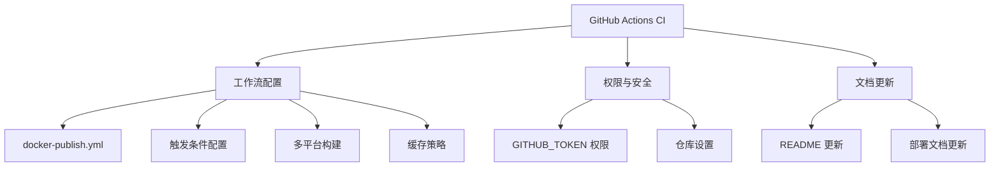
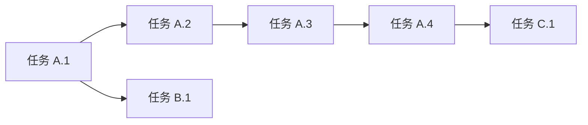

# 功能规划：GitHub Actions CI - 容器镜像发布

**规划时间**：2026-01-27
**预估工作量**：6 任务点

---

## 1. 功能概述

### 1.1 目标
创建 GitHub Actions CI 工作流，实现自动化构建并发布容器镜像到 GitHub Container Registry (ghcr.io)。

### 1.2 范围
**包含**：
- GitHub Actions 工作流配置文件
- 多平台构建支持 (linux/amd64, linux/arm64)
- 智能镜像标签策略
- 构建缓存优化
- 权限配置说明

**不包含**：
- 现有 Dockerfile 修改（已满足需求）
- 自动化测试集成（当前无 CI 测试）
- 部署到生产环境（仅构建发布镜像）

### 1.3 技术约束
- **Go 版本**：1.22
- **CGO**：必须启用（SQLite 依赖 modernc.org/sqlite）
- **构建工具**：Docker Buildx
- **镜像仓库**：ghcr.io/timoul/orchids-2api
- **认证方式**：GITHUB_TOKEN（内置，无需额外配置）

---

## 2. WBS 任务分解

### 2.1 分解结构图



### 2.2 任务清单

#### 模块 A：GitHub Actions 工作流（4 任务点）

**文件**: `.github/workflows/docker-publish.yml`

- [ ] **任务 A.1**：创建工作流基础结构（1 点）
  - **输入**：触发条件需求（push main、tag v*）
  - **输出**：工作流文件框架
  - **关键步骤**：
    1. 定义工作流名称和触发条件
    2. 配置 `on.push.branches` 和 `on.push.tags`
    3. 设置 `permissions` 块授权 packages 写入

- [ ] **任务 A.2**：配置镜像元数据和标签策略（1 点）
  - **输入**：标签需求（latest、版本号、commit sha）
  - **输出**：docker/metadata-action 配置
  - **关键步骤**：
    1. 使用 `docker/metadata-action` 生成标签
    2. 配置 `type=ref,event=branch` 生成 latest
    3. 配置 `type=semver,pattern={{version}}` 生成版本号
    4. 配置 `type=sha` 生成 commit sha 标签

- [ ] **任务 A.3**：实现多平台构建（1 点）
  - **输入**：目标平台（linux/amd64, linux/arm64）
  - **输出**：Docker Buildx 多平台构建配置
  - **关键步骤**：
    1. 使用 `docker/setup-qemu-action` 配置 QEMU
    2. 使用 `docker/setup-buildx-action` 配置 Buildx
    3. 在 `build-push-action` 中指定 `platforms`

- [ ] **任务 A.4**：配置构建缓存优化（1 点）
  - **输入**：缓存策略需求
  - **输出**：GitHub Actions cache 配置
  - **关键步骤**：
    1. 配置 `cache-from: type=gha`
    2. 配置 `cache-to: type=gha,mode=max`
    3. 利用 Docker 层缓存加速构建

#### 模块 B：权限与仓库配置（1 任务点）

**文件**: 仓库设置（GitHub Web UI）

- [ ] **任务 B.1**：配置仓库权限（1 点）
  - **输入**：GITHUB_TOKEN 权限需求
  - **输出**：正确的仓库权限设置
  - **关键步骤**：
    1. 进入 Settings > Actions > General
    2. 确认 "Workflow permissions" 设置为 "Read and write permissions"
    3. 或在工作流中显式声明 `permissions.packages: write`

#### 模块 C：文档更新（1 任务点）

**文件**: `docs/deployment.md`, `README.md`

- [ ] **任务 C.1**：更新部署文档（1 点）
  - **输入**：新增的 CI/CD 流程
  - **输出**：更新后的文档
  - **关键步骤**：
    1. 添加 GitHub Container Registry 使用说明
    2. 添加镜像拉取命令示例
    3. 更新 docker-compose.yml 示例使用 ghcr.io 镜像

---

## 3. 依赖关系

### 3.1 依赖图



### 3.2 依赖说明

| 任务 | 依赖于 | 原因 |
|------|--------|------|
| 任务 A.2 | 任务 A.1 | 标签策略需要在工作流框架内配置 |
| 任务 A.3 | 任务 A.2 | 多平台构建需要先配置好元数据 |
| 任务 A.4 | 任务 A.3 | 缓存配置是构建步骤的一部分 |
| 任务 C.1 | 任务 A.4 | 文档需要在工作流完成后更新 |

### 3.3 并行任务

以下任务可以并行开发：
- 任务 A.1 // 任务 B.1（工作流编写和仓库配置可同时进行）

---

## 4. 实施建议

### 4.1 技术选型

| 需求 | 推荐方案 | 理由 |
|------|----------|------|
| 容器构建 | docker/build-push-action@v6 | 官方维护，功能完善 |
| 多平台支持 | QEMU + Buildx | 业界标准方案 |
| 缓存策略 | GitHub Actions Cache (gha) | 原生集成，无需额外配置 |
| 镜像标签 | docker/metadata-action@v5 | 自动化标签生成 |
| 认证方式 | GITHUB_TOKEN | 内置 token，无需配置 secrets |

### 4.2 潜在风险

| 风险 | 影响 | 缓解措施 |
|------|------|----------|
| ARM64 构建时间长 | 中 | CGO 交叉编译耗时较长，首次构建约 10-15 分钟 |
| 缓存失效 | 低 | go.mod 变更会导致缓存失效，但 Docker 层缓存仍有效 |
| QEMU 模拟慢 | 中 | ARM64 通过 QEMU 模拟，比原生慢 5-10 倍 |

### 4.3 测试策略

- **手动测试**：推送 tag 后验证镜像是否正确发布
- **镜像验证**：拉取镜像并运行 `docker run --rm ghcr.io/timoul/orchids-2api:latest ./server --version`（如支持）
- **多平台验证**：使用 `docker manifest inspect` 确认多架构支持

---

## 5. 验收标准

功能完成需满足以下条件：

- [ ] 推送到 main 分支触发构建
- [ ] 创建 v* 标签触发构建
- [ ] 镜像成功发布到 ghcr.io/timoul/orchids-2api
- [ ] 生成正确的标签：latest (main)、版本号 (tag)、sha-xxxxx
- [ ] 支持 linux/amd64 和 linux/arm64 平台
- [ ] 构建缓存正常工作（第二次构建明显加速）
- [ ] 文档更新完成

---

## 6. 详细配置文件

### 6.1 工作流配置文件

**文件路径**: `.github/workflows/docker-publish.yml`

```yaml
name: Docker 镜像构建与发布

on:
  push:
    branches:
      - main
    tags:
      - 'v*'

env:
  REGISTRY: ghcr.io
  IMAGE_NAME: ${{ github.repository }}

jobs:
  build-and-push:
    runs-on: ubuntu-latest

    permissions:
      contents: read
      packages: write
      attestations: write
      id-token: write

    steps:
      - name: 检出代码
        uses: actions/checkout@v4

      - name: 设置 QEMU
        uses: docker/setup-qemu-action@v3

      - name: 设置 Docker Buildx
        uses: docker/setup-buildx-action@v3

      - name: 登录 GitHub Container Registry
        uses: docker/login-action@v3
        with:
          registry: ${{ env.REGISTRY }}
          username: ${{ github.actor }}
          password: ${{ secrets.GITHUB_TOKEN }}

      - name: 提取镜像元数据
        id: meta
        uses: docker/metadata-action@v5
        with:
          images: ${{ env.REGISTRY }}/${{ env.IMAGE_NAME }}
          tags: |
            # main 分支 -> latest
            type=raw,value=latest,enable=${{ github.ref == 'refs/heads/main' }}
            # tag v1.2.3 -> 1.2.3
            type=semver,pattern={{version}}
            # tag v1.2.3 -> 1.2
            type=semver,pattern={{major}}.{{minor}}
            # tag v1.2.3 -> 1
            type=semver,pattern={{major}}
            # 所有提交 -> sha-xxxxxxx
            type=sha,prefix=sha-

      - name: 构建并推送镜像
        id: push
        uses: docker/build-push-action@v6
        with:
          context: .
          platforms: linux/amd64,linux/arm64
          push: true
          tags: ${{ steps.meta.outputs.tags }}
          labels: ${{ steps.meta.outputs.labels }}
          cache-from: type=gha
          cache-to: type=gha,mode=max

      - name: 生成构建摘要
        run: |
          echo "## 镜像构建完成" >> $GITHUB_STEP_SUMMARY
          echo "" >> $GITHUB_STEP_SUMMARY
          echo "**镜像标签:**" >> $GITHUB_STEP_SUMMARY
          echo '```' >> $GITHUB_STEP_SUMMARY
          echo "${{ steps.meta.outputs.tags }}" >> $GITHUB_STEP_SUMMARY
          echo '```' >> $GITHUB_STEP_SUMMARY
          echo "" >> $GITHUB_STEP_SUMMARY
          echo "**支持平台:** linux/amd64, linux/arm64" >> $GITHUB_STEP_SUMMARY
```

### 6.2 需要配置的 GitHub Secrets

**无需额外配置**。工作流使用内置的 `GITHUB_TOKEN`，该 token 自动由 GitHub Actions 提供。

但需要确认仓库设置：
1. 进入仓库 Settings > Actions > General
2. 滚动到 "Workflow permissions"
3. 确保选择 "Read and write permissions"

### 6.3 文件结构

```
.github/
└── workflows/
    └── docker-publish.yml    # 新增：CI 工作流配置
```

---

## 7. 实施步骤清单

### 第一阶段：创建工作流文件

1. [ ] 创建 `.github/workflows/` 目录
2. [ ] 创建 `docker-publish.yml` 文件
3. [ ] 复制上述工作流配置

### 第二阶段：仓库配置

4. [ ] 进入 GitHub 仓库 Settings
5. [ ] 导航到 Actions > General
6. [ ] 确认 Workflow permissions 设置正确

### 第三阶段：测试验证

7. [ ] 推送代码到 main 分支，验证 CI 触发
8. [ ] 检查 Actions 页面确认构建成功
9. [ ] 检查 Packages 页面确认镜像发布
10. [ ] 拉取镜像验证可用性：
    ```bash
    docker pull ghcr.io/timoul/orchids-2api:latest
    docker run --rm ghcr.io/timoul/orchids-2api:latest ls -la
    ```

### 第四阶段：标签发布测试

11. [ ] 创建并推送版本标签：
    ```bash
    git tag v1.0.0
    git push origin v1.0.0
    ```
12. [ ] 验证生成的镜像标签：
    - `ghcr.io/timoul/orchids-2api:1.0.0`
    - `ghcr.io/timoul/orchids-2api:1.0`
    - `ghcr.io/timoul/orchids-2api:1`
    - `ghcr.io/timoul/orchids-2api:sha-xxxxxxx`

### 第五阶段：文档更新

13. [ ] 更新 `docs/deployment.md` 添加 ghcr.io 使用说明
14. [ ] 更新 `docker-compose.yml` 示例使用 ghcr.io 镜像

---

## 8. 镜像使用示例

### 8.1 拉取镜像

```bash
# 拉取最新版本
docker pull ghcr.io/timoul/orchids-2api:latest

# 拉取指定版本
docker pull ghcr.io/timoul/orchids-2api:1.0.0

# 拉取指定 commit
docker pull ghcr.io/timoul/orchids-2api:sha-abc1234
```

### 8.2 docker-compose.yml 示例

```yaml
version: '3.8'
services:
  orchids-api:
    image: ghcr.io/timoul/orchids-2api:latest
    container_name: orchids-api
    ports:
      - "3002:3002"
    environment:
      - PORT=3002
      - DEBUG_ENABLED=true
      - ADMIN_USER=admin
      - ADMIN_PASS=your_secure_password
      - ADMIN_PATH=/admin
    volumes:
      - ./data:/app/data
    restart: unless-stopped
```

---

## 9. 后续优化方向

Phase 2 可考虑的增强：

- **添加测试步骤**：在构建前运行 `go test ./...`
- **安全扫描**：集成 Trivy 或 Snyk 进行镜像漏洞扫描
- **SBOM 生成**：使用 `syft` 生成软件物料清单
- **签名验证**：使用 Cosign 对镜像进行签名
- **构建通知**：集成 Slack/Discord 通知
- **自动部署**：添加 CD 步骤自动部署到生产环境
