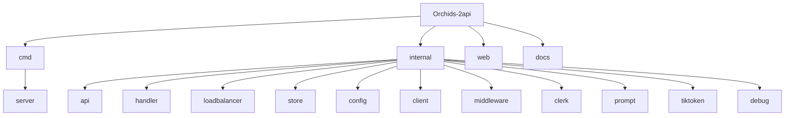

# Orchids-2api

## 项目愿景

Orchids-2api 是一个 Go 语言编写的 API 代理服务器，提供多账号管理与负载均衡代理功能，兼容 Claude API 格式的请求转发。它将客户端的 Claude API 请求代理到 Orchids 后端服务，并提供 Web 管理界面进行账号管理。

## 架构总览

```
客户端 (Claude API 格式)
    |
    v
+-------------------+
|  /v1/messages     | <-- Handler (请求处理器)
+-------------------+
    |
    v
+-------------------+
|  LoadBalancer     | <-- 加权随机选择账号
+-------------------+
    |
    v
+-------------------+
|  Prompt Builder   | <-- 转换为 Markdown 格式
+-------------------+
    |
    v
+-------------------+
|  Client           | <-- 通过 Clerk 认证
+-------------------+
    |
    v
Orchids 上游服务器 (Azure)
```

## 模块结构图



## 模块索引

| 路径 | 职责 | 语言 |
|------|------|------|
| `cmd/server` | 应用入口，路由配置，服务启动 | Go |
| `internal/api` | 账号管理 REST API (CRUD、导入导出) | Go |
| `internal/handler` | 主请求处理器，SSE 流式响应转换 | Go |
| `internal/loadbalancer` | 加权随机负载均衡算法 | Go |
| `internal/store` | SQLite 数据库层，账号持久化 | Go |
| `internal/config` | 环境变量配置加载 | Go |
| `internal/client` | 上游 API 客户端，Clerk 认证 | Go |
| `internal/middleware` | HTTP Basic Auth 中间件 | Go |
| `internal/clerk` | Clerk 认证服务集成 | Go |
| `internal/prompt` | Claude 消息到 Markdown 的转换 | Go |
| `internal/tiktoken` | Token 计数估算 | Go |
| `internal/debug` | 调试日志记录 | Go |
| `web` | 静态资源嵌入与管理界面 | Go/HTML |

## 运行与开发

### 环境要求

- Go 1.22+
- Docker (可选，用于容器化部署)

### 本地开发

```bash
# 下载依赖
go mod download

# 运行服务
go run ./cmd/server/main.go

# 构建
go build -o orchids-api ./cmd/server

# 运行测试
go test ./...
```

### Docker 部署

```bash
# 构建镜像
./build.sh
# 或
docker build --platform linux/amd64 -f ./Dockerfile -t opus-api:latest .

# 运行容器
docker compose up -d
```

### 环境变量

| 变量 | 默认值 | 说明 |
|------|--------|------|
| `PORT` | 3002 | 服务端口 |
| `DEBUG_ENABLED` | true | 启用调试日志 |
| `ADMIN_USER` | admin | 管理界面用户名 |
| `ADMIN_PASS` | admin123 | 管理界面密码 |
| `ADMIN_PATH` | /admin | 管理界面路径 |

## 测试策略

- 单元测试位于 `internal/tiktoken/tokenizer_test.go`
- 测试覆盖 Token 估算算法 (`EstimateTokens`, `EstimateTextTokens`, `IsCJK`)
- 运行测试: `go test ./...`

## 编码规范

- 使用标准 Go 项目布局 (`cmd/`, `internal/`, `web/`)
- 遵循 Go 官方代码风格
- 使用 `internal/` 包限制包可见性
- 错误处理遵循 Go 惯例 (返回 error)
- 使用 `//go:embed` 嵌入静态资源

## AI 使用指引

### 关键文件

- **入口**: `cmd/server/main.go`
- **核心逻辑**: `internal/handler/handler.go` (SSE 流处理)
- **数据模型**: `internal/store/store.go` (Account 结构)
- **API 定义**: `internal/api/api.go`

### 常见任务

1. **添加新的 API 端点**: 修改 `cmd/server/main.go` 路由配置和 `internal/api/api.go`
2. **修改负载均衡策略**: 编辑 `internal/loadbalancer/loadbalancer.go`
3. **调整 prompt 格式**: 编辑 `internal/prompt/prompt.go`
4. **修改数据模型**: 编辑 `internal/store/store.go` 并更新 migrate() 函数

### 注意事项

- 上游服务器地址: `https://orchids-server.calmstone-6964e08a.westeurope.azurecontainerapps.io/agent/coding-agent`
- Clerk API 地址: `https://clerk.orchids.app/v1/client`
- 使用 CGO_ENABLED=1 构建 (SQLite 依赖)

## 变更记录 (Changelog)

| 日期 | 版本 | 变更内容 |
|------|------|----------|
| 2026-01-27 | 1.0.0 | 初始架构文档生成 |
